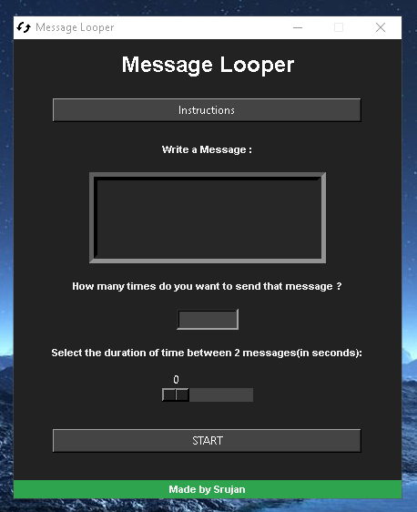

# Message Looper (Only For Windows)
With this program you can loop messages many times Wether on whatsapp, Messenger or any platform.

  

## Download:
<a href="https://github.com/Royal-lobster/messagelooper-Python/raw/master/dist/MessageLooper%20(SETUP).exe">Click here to Download the Application</a>

## Instructions:
1. Write a Message in the message box
2. Set the number of times the message must be sent
3. Select time delay in between two messages
4. Press Start button
5. Select the text field in your prefered messageing app
6. Press "s" to start the looper
**THATS IT!**

Note: IF YOU WANT TO ABORT THE PROGRAM PRESS "q" 

## LICENSE
Copyright 2020 Srujan Gurram

Permission is hereby granted, free of charge, to any person obtaining a copy of this software and associated documentation files (the "Software"), to deal in the Software without restriction, including without limitation the rights to use, copy, modify, merge, publish, distribute, sublicense, and/or sell copies of the Software, and to permit persons to whom the Software is furnished to do so, subject to the following conditions:

The above copyright notice and this permission notice shall be included in all copies or substantial portions of the Software.

THE SOFTWARE IS PROVIDED "AS IS", WITHOUT WARRANTY OF ANY KIND, EXPRESS OR IMPLIED, INCLUDING BUT NOT LIMITED TO THE WARRANTIES OF MERCHANTABILITY, FITNESS FOR A PARTICULAR PURPOSE AND NONINFRINGEMENT. IN NO EVENT SHALL THE AUTHORS OR COPYRIGHT HOLDERS BE LIABLE FOR ANY CLAIM, DAMAGES OR OTHER LIABILITY, WHETHER IN AN ACTION OF CONTRACT, TORT OR OTHERWISE, ARISING FROM, OUT OF OR IN CONNECTION WITH THE SOFTWARE OR THE USE OR OTHER DEALINGS IN THE SOFTWARE.
